# 🏘️ Meus Aluguéis

**Descrição**  
*Meus Aluguéis* é um sistema de gestão de imóveis focado em imobiliárias e proprietários independentes. Ele oferece funcionalidades de cadastro de usuários, imóveis e locatários, além de gerenciar pagamentos, manutenção, contratos e documentos, tudo em um único local. O sistema também oferece um dashboard para acompanhamento de pendências e notificações automáticas para vencimentos de contratos e pagamentos.

## ✨ Funcionalidades Principais

- 📝 **Cadastro** de usuários e locatários (CPF/CNPJ)
- 🏠 **Cadastro e edição** de imóveis e "rentals" (entidade pai de imóveis)
- 💼 **Gerenciamento** de contratos, pagamentos e notificações
- 📞 **Omnichannel**: Suporte a clientes via chat, email e WhatsApp
- 👨‍💼 **Gestão de corretores**: Definição de comissões, metas e carteiras de clientes
- 📊 **Dashboard** com visualização de contratos e metas
- 🛠️ **Controle de manutenção** de imóveis alugados
- 📅 **Sistema de notificações** para vencimentos de contratos e pagamentos

## 🛠️ Tecnologias Utilizadas

Este projeto foi construído utilizando as seguintes tecnologias:

- **Java 17** ☕
- **Spring Boot 3.3.3** 🚀
- **Thymeleaf** 🌿 (para renderização de templates)
- **Spring Data JPA** 🗃️ (para persistência de dados)
- **MariaDB** 🐬 e **H2 Database** 🛢️ (ambiente de desenvolvimento)
- **Bootstrap 5.1.3** 🎨 e **jQuery** 💻 (para interface do usuário)
- **Maven** 📦 (para gerenciamento de dependências)

## Diagrama de Classes 🗂️
Este é o diagrama de classes representando a arquitetura do sistema.

